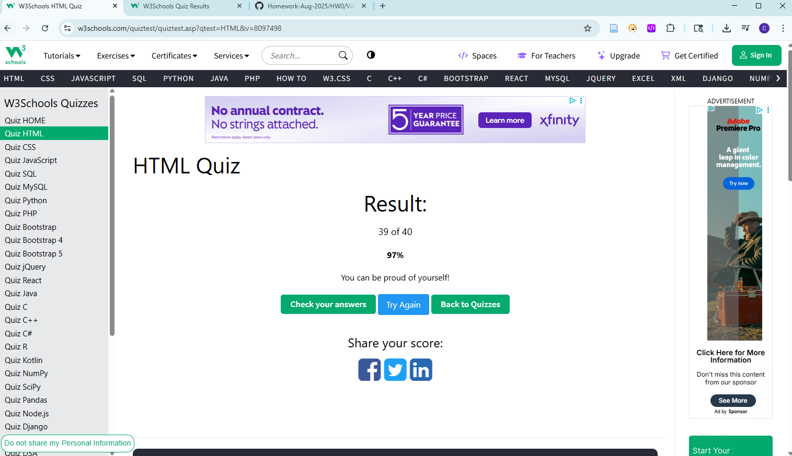

# HTML Interview Questions

## 1. What is HTML?

**Answer:** HyperText Markup Language (HTML) is the standard language used to create the structure of web pages.

## 2. What is the minimal structure of an HTML5 document?

**Answer:**

```html
<!DOCTYPE html>
<html lang="en">
<head>
  <meta charset="UTF-8">
  <title>Page Title</title>
</head>
<body>
  <p>Hello, world!</p>
</body>
</html>
```

**Explanation:**
- `<!DOCTYPE html>` → Declares the document is HTML5
- `<html>` → Root element
- `<head>` → Contains metadata (not displayed to users)
- `<body>` → Contains visible content

## 3. What is the purpose of the `<meta>` tag?

**Answer:** Provides metadata (information about the webpage) to the browser and search engines.

**Examples:**
- Set character encoding: `<meta charset="UTF-8">`
- Responsive design: `<meta name="viewport" content="width=device-width, initial-scale=1.0">`
- SEO: `<meta name="description" content="Best tutorials for HTML and CSS">`

## 4. What is the difference between `<head>` and `<header>`?

**Answer:**
- **`<head>`**: Part of the HTML document that contains metadata, links to stylesheets/scripts, and page information (not shown to users)
- **`<header>`**: A visible section at the top of a page or section. It usually contains the logo, navigation menu, or title

## 5. What is the `<form>` tag used for in HTML?

**Answer:**
- Defines a form to collect user input
- Can include fields like text boxes, radio buttons, checkboxes, dropdowns, etc.

## 6. Explain the following code:

```html
<a href="http://example.com/sample_page/" rel="noreferrer nofollow">Link</a>
```

**Answer:** This is an anchor tag that contains a URL for redirecting to another page. The `rel="noreferrer nofollow"` attributes prevent the new opened page from manipulating the original page's JavaScript files and hide information about where the user came from.

## 7. How do you serve your page in multiple languages?

**Answer:**
- Use the `lang` attribute in the HTML tag
- Create separate language versions of each HTML page
## 8. What are semantic HTML tags and why are they important?

**Answer:** Semantic tags are HTML elements that describe the meaning of their content.

**Examples:**
- `<header>` → Top section of a page
- `<nav>` → Navigation menu
- `<article>` → Independent article content
- `<section>` → Section of content
- `<footer>` → Footer area

**Benefits:**
- **SEO**: Search engines better understand page structure
- **Accessibility**: Screen readers can interpret content properly
- **Maintainability**: Makes code more readable and maintainable
## 9. What frontend practices can improve a website’s SEO, and why do they matter?

**Answer:**

- **Use semantic HTML tags** → Helps search engines understand content hierarchy
- **Mobile responsiveness** → Google prioritizes mobile-friendly sites
- **Alt text for images** → Improves accessibility and image search indexing
- **Meta tags** (title, description, keywords) → Improves search engine ranking
- **Structured data** (JSON-LD, schema.org) → Helps create rich snippets (stars, product info, etc.)
- **Clean URLs** → Descriptive links rank better (`/blog/html5-tutorial` > `/post?id=123`)
- **Avoid duplicate content** → Use canonical tags

---

## W3Schools HTML Quiz Result

