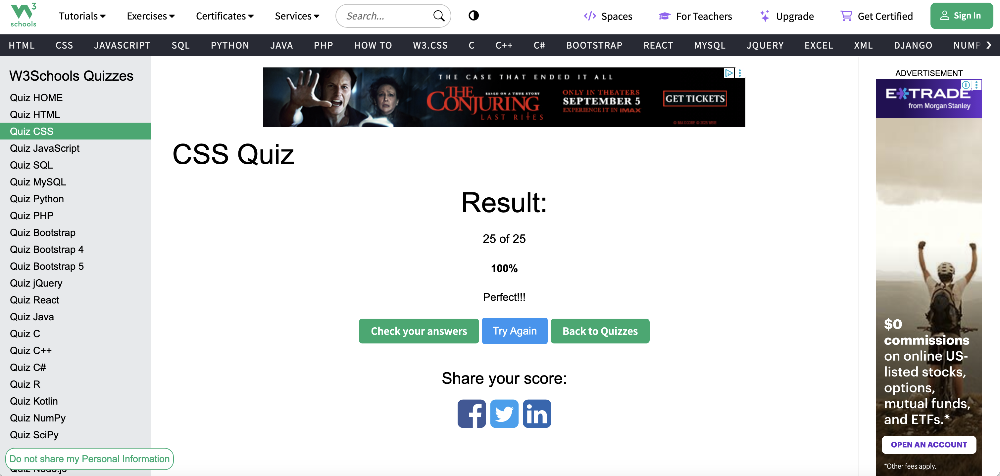

1. What is CSS?

CSS stands for Cascading /kæˈskeɪ.dɪŋ/ Style Sheets. HTML gives us the structure, but CSS is what makes it look nice — like setting colors, fonts, and layout. Without CSS, every page would just look like plain text with no design.

2. How do you link a CSS file to an HTML document?

We usually put it in the <head> of the HTML file. The code is <link rel="stylesheet" href="style.css">. That tells the browser: “Hey, use this CSS file to style the HTML.”

3. What is block element? Difference from inline and inline-block?

A block element always starts on a new line and takes the full width. Inline only takes up as much space as the text or content. Inline-block is in between — it sits inline, but you can still set width and height.

4. Difference between /ˈsuː.doʊ/ pseudo-class and pseudo-element?

A pseudo-class is for a special state of an element, like :hover /ˈhʌv.ɚ/ when you move the mouse over it. A pseudo-element lets you style a specific part, like ::before （double colon） or ::after to add content inside the element.

5. Child combinator vs descendant combinator?

The child combinator > only selects direct children of an element. The descendant combinator, just a space, will select all nested elements no matter how deep inside.

6. Two ways to make an element invisible? Difference?

display: none removes the element completely, like it doesn’t exist. visibility: hidden hides it, but the space is still there. So with hidden, layout doesn’t collapse /kəˈlæps/.

7. What is the Box Model?

Every element in CSS is basically a box. Inside you have content, then padding, then border, then margin on the outside. The total size of the element comes from adding all of these together.

8. What does （bang） !important do? Use cases?

!important tells the browser “this style wins no matter what.” It can override other rules. It’s sometimes used for quick fixes or when using third-party CSS, but in general it’s better to avoid because it makes code harder to maintain.

9. What does z-index do?

Z-index controls stacking order, basically which element is on top of which. A higher z-index value means that element will overlap and appear above lower ones.

10. Can padding and margin be negative?

Padding cannot be negative, because you can’t have “negative space” inside. Margin can be negative, and that pulls elements closer together, or even overlaps them.

11. How do you center a block element?

The classic way is margin: 0 auto; which centers it horizontally. For modern layouts, I often use flexbox: set the parent to display: flex; justify-content: center; align-items: center; — that centers both horizontally and vertically.

12. What are grid items? Some properties?

Grid items are the children inside a CSS grid container. You can tell them where to sit using properties like grid-column and grid-row, and align them with justify-self or align-self.

13. What is a flex container? Some properties?

A flex container is created with display: flex;. It helps lay out items in a row or column. Common properties are flex-direction, justify-content, align-items, and flex-wrap to handle multiple rows.

14. Parent width 200px, child width auto — what happens?

If the parent is 200px wide and the child is auto, the child will just take up the space it needs by default, but it can’t go beyond the parent’s 200px. So usually it just fills the available width.

15. What is responsive web design? How do we achieve this?

Responsive design means the website adapts to different screen sizes — like desktop, tablet, and mobile. We achieve it by using flexible units like percentages, layouts like flexbox or grid, and media queries to adjust styles at different breakpoints.

