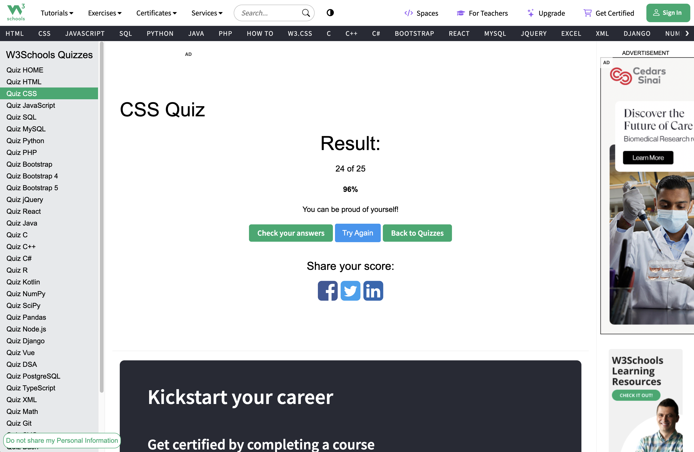

# 1. What is CSS?

CSS stands for Cascading Style Sheets. It is used to style HTML by controlling layout, colors, fonts, and spacing.

# 2. How do you link a CSS file to an HTML document?

You use the <link> tag inside the <head> section like <link rel="stylesheet" href="style.css">.

# 3. What is block element? How is it different from inline, and inline-block elements?

A block element takes the full width and starts on a new line. An inline element only takes as much space as its content and does not break the line. An inline-block element behaves like inline but allows setting width and height.

# 4. What is the difference between pseudo-class and pseudo-element?

A pseudo-class selects elements in a specific state (like :hover). A pseudo-element creates and styles a specific part of an element.

# 5. What is the difference between the child combinator and the descendant combinator?

The child combinator (A > B) selects direct children only. The descendant combinator (A B) selects all nested elements, no matter how deep.

# 6. What are two ways that we can make an element invisible? What is the difference?

You can use display: none, which removes it from the layout, or visibility: hidden, which hides it but still keeps its space.

# 7. What is the Box Model? Describe each part.

Every element is a box with four parts: content, padding (space around content), border, and margin (space outside the border).

# 8. What is the usage of !important? What are some use cases?

!important overrides all other CSS rules. It should be used sparingly, often for quick fixes or when overriding third-party styles.

# 9. What does z-index do?

z-index controls the stacking order of elements along the z-axis, deciding which one appears on top.

# 10. Can padding and margin be negative?

Padding cannot be negative. Margin can be negative and is often used to pull elements closer together.

# 11. How do you center a block element with CSS?

You can set a fixed width and use margin: 0 auto;.

# 12. What are grid items? Can you explain some grid item properties?

Grid items are direct children of a grid container. Properties like grid-column, grid-row, and justify-self control their placement and alignment.

# 13. What is a flex container? Can you explain some flex container properties?

A flex container is an element with display: flex. Properties like flex-direction, justify-content, and align-items control the direction and alignment of its children.

# 14. Assume a parent element has width = 200px and one child element. If the child element’s width is set to ‘auto’, what are the values of its width, left-margin, & right-margin?

The child’s width will fill the available space (200px). Both left and right margins will be 0.

# 15. What is responsive web design? How do we achieve this?

Responsive design means a website adapts to different screen sizes. It is achieved with flexible layouts, relative units, media queries, and responsive images.

