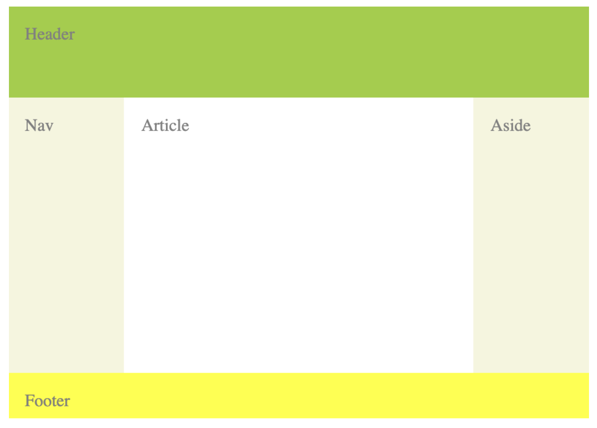
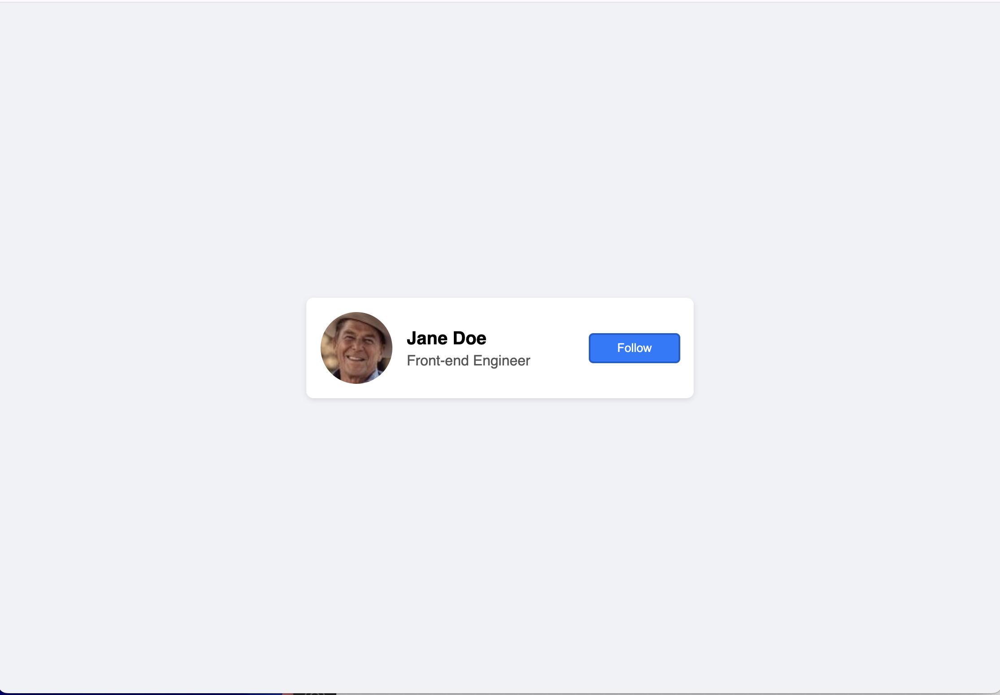
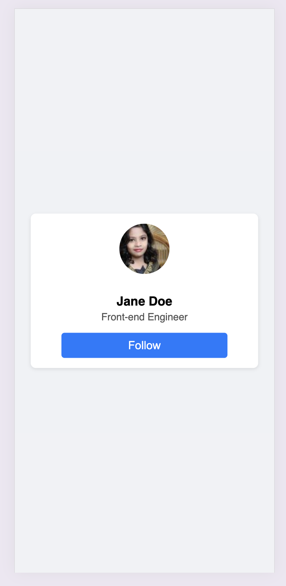
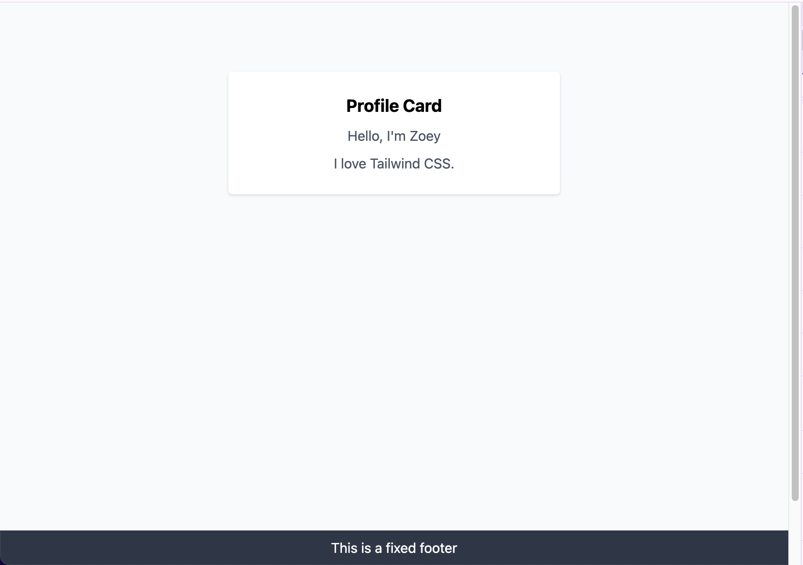

# HW2 - CSS

### 0. Leetcode

https://leetcode.com/problem-list/oizxjoit/

每天1-3道题，需要用JavaScript或者TypeScript

### 1. 问答练习(八股）

准备以下⼋股题⽬答案, 写在`note.md`⾥

<aside>

1. What is CSS?
2. How do you link a CSS file to an HTML document?
3. What is block element? How is it different from inline, and inline-block elements?
4. What is the difference between pseudo-class and pseudo-element?
5. What is the difference between the child combinator and the descendant combinator?
6. What are two ways that we can make an element invisible? What is the difference?
7. What is the Box Model? Describe each part.
8. What is the usage of !important? What are some use cases?
9. What does z-index do?
10. Can padding and margin be negative?
11. How do you center a block element with CSS?
12. What are grid items? Can you explain some grid item properties?
13. What is a flex container? Can you explain some flex container properties?
14. Assume a parent element has *width = 200px* and one child element*.* If the child element’s width is set to ‘auto’, what are the values of its width, left-margin, & right-margin?
15. Can you explain the difference between px, em and rem as they relate to font sizing?
16. What is responsive web design? How do we achieve this?
</aside>

⼩组间Peer Mock，录⾳并上传

### 2. Quiz

- W3 schools CSS Quiz [https://www.w3schools.com/css/css_quiz.asp](https://www.w3schools.com/css/css_quiz.asp)
- Please attach the screenshot of your results in `note.md`

### 3. Coding

1. Implement the page with 
    1. Flexbox `display:flex`
    2. Grid `display:grid`



2. Create a Name card. 

- Overall background color is `#f0f2f5` , and font-family is `sans-serif`
- Background color of the name card is white
- Color of the button is `#007bff`
- When hovering on Follow button, the color will darken (choose a color you like). The cursor will be a pointer
- When hovering on the avatar, its size will be a little larger.
- The avatar image can be found here - [https://i.pravatar.cc/80](https://i.pravatar.cc/80)



- Implement responsive design so that elements switch to a vertical (column) layout.
    - hint - `@media screen and (max-width: 600px)`



3. Build a simple “Profile Card” page with Tailwind

- A **centered** **card** with:
    - Background color
    - Padding and margin
    - A title and short paragraph
    - Hover effect to change background color
- A **fixed footer** at the bottom:
    - Keep the footer at the bottom of the screen, even when the page is scrolled.
    - Full width with background
- Starter code
    
    ```html
    <!DOCTYPE html>
    <html lang="en">
      <head>
        <meta charset="UTF-8" />
        <title>Tailwind Assignment</title>
        <link
          href="https://unpkg.com/tailwindcss@%5E1.0/dist/tailwind.min.css"
          rel="stylesheet"
        />
      </head>
      <body class="bg-gray-100 min-h-screen">
        <!-- Put your code here -->
      </body>
    </html>
    ```
    

