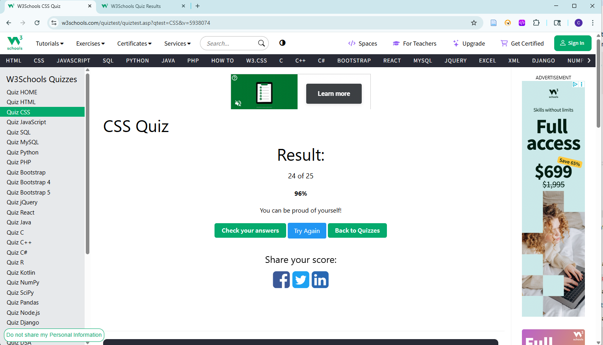

# CSS Study Notes

## 1. What is CSS?

**CSS (Cascading Style Sheets)** is a language used to describe the presentation of an HTML document—how elements look (colors, fonts, spacing, layout, etc.).

## 2. How do you link a CSS file to an HTML document?

Use the `<link>` tag inside the `<head>`:

```html
<link rel="stylesheet" href="styles.css">
```

## 3. What is block element? How is it different from inline, and inline-block elements?

- **Block**: Takes the full width available and starts on a new line (e.g., `<div>`, `<p>`)
- **Inline**: Only takes as much width as needed, does not start on a new line (e.g., `<span>`, `<a>`)
- **Inline-block**: Behaves like inline (stays in line), but can have width/height like block elements

## 4. What is the difference between pseudo-class and pseudo-element?

- **Pseudo-class**: Targets an element's state (e.g., `:hover`, `:focus`)
- **Pseudo-element**: Targets a part of an element (e.g., `::before`, `::after`, `::first-line`)

## 5. What is the difference between the child combinator and the descendant combinator?

- **Child combinator (>)**: Selects direct children only
  - Example: `div > p` → `<p>` that is an immediate child of `<div>`
- **Descendant combinator (space)**: Selects all nested children at any depth
  - Example: `div p` → `<p>` inside `<div>`, no matter how deep

## 6. What are two ways that we can make an element invisible? What is the difference?

- `display: none;` → Removes element from layout (no space taken)
- `visibility: hidden;` → Hides element but still occupies space

## 7. What is the Box Model? Describe each part.

Every element is a rectangular box made of:

- **Content** → Text or image inside
- **Padding** → Space between content and border
- **Border** → The outline around padding/content
- **Margin** → Space outside the border (separates from other elements)

## 8. What is the usage of !important? What are some use cases?

Forces a style rule to override all others, even inline styles.

- **Use cases**: Quick overrides, third-party CSS conflicts
- **Caution**: Overuse reduces maintainability

## 9. What does z-index do?

Controls the stacking order of elements along the z-axis. Higher z-index = element appears "on top." Only works with positioned elements (`position: relative/absolute/fixed/sticky`).

## 10. Can padding and margin be negative?

- **Padding**: ❌ No, cannot be negative
- **Margin**: ✅ Yes, can be negative (useful for pulling elements closer)

## 11. How do you center a block element with CSS?

Using flexbox:

```css
.container {
  display: flex;              /* enable flexbox */
  justify-content: center;    /* center horizontally */
  align-items: center;        /* center vertically */
}
```

## 12. What are grid items? Can you explain some grid item properties?

**Grid items** are direct children of a CSS Grid container.

Key properties include:
- `grid-column-start`, `grid-column-end` (span columns)
- `grid-row-start`, `grid-row-end` (span rows)
- `justify-self` (align horizontally)
- `align-self` (align vertically)

## 13. What is a flex container? Can you explain some flex container properties?

A **flex container** is an element with `display: flex;`.

Key properties:
- `flex-direction` → row / column layout
- `justify-content` → align items horizontally
- `align-items` → align items vertically
- `flex-wrap` → allow items to wrap to next line

## 14. Assume a parent element has width = 200px and one child element. If the child element's width is set to 'auto', what are the values of its width, left-margin, & right-margin?

- **Width**: `auto` = fills remaining width of parent minus padding/margins
- If margins not set → `margin-left = 0`, `margin-right = 0`
- If `margin: auto` used → child is centered (margins share remaining space)

## 15. What is responsive web design? How do we achieve this?

**Responsive web design** ensures a site adapts to different screen sizes/devices.

Achieved via:
- **Relative units** (%, em, rem, vh, vw)
- **Media queries** (`@media (max-width: 768px) { ... }`)
- **Flexible layouts** (Flexbox, Grid)
- **Fluid images** (`max-width: 100%`)

---


